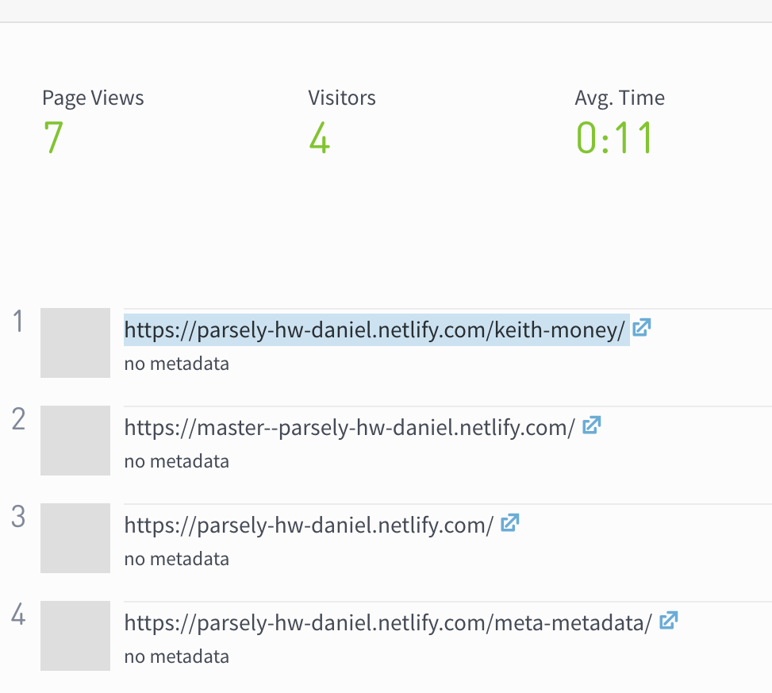
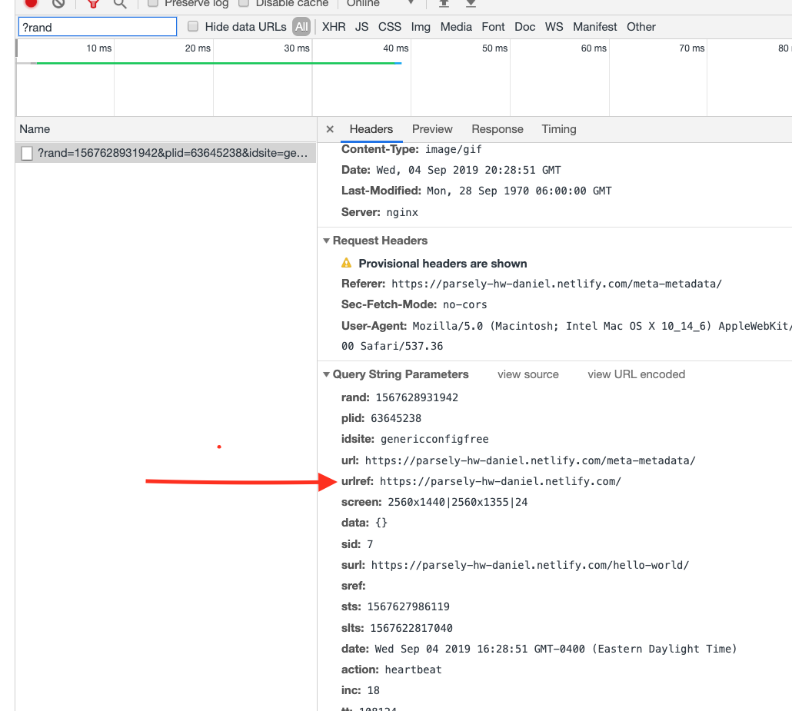
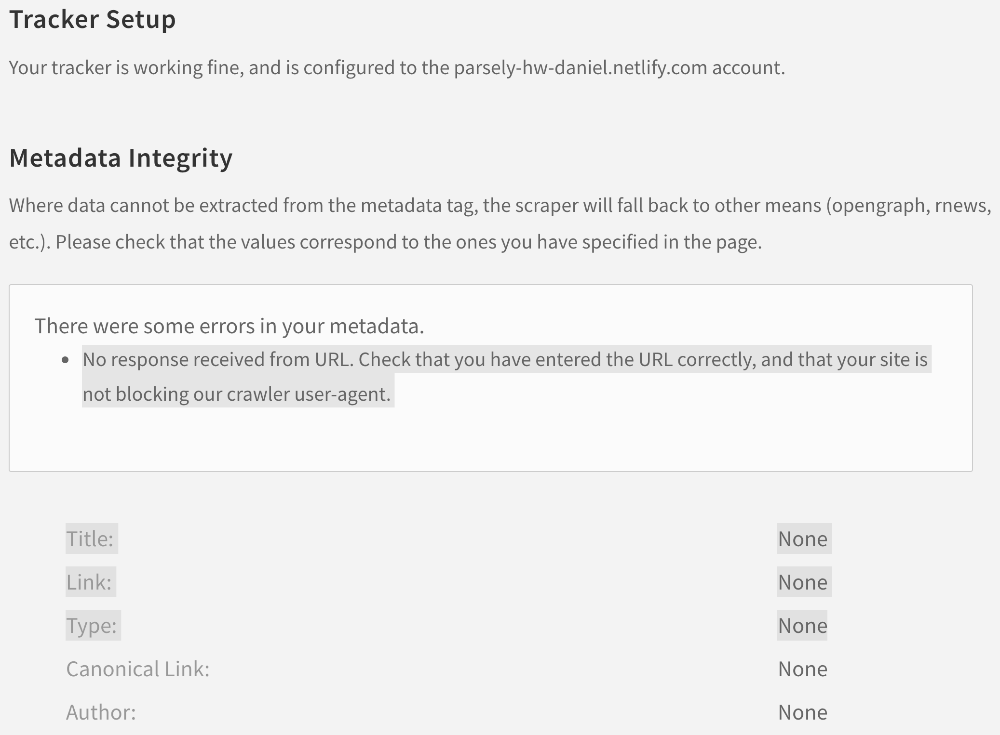

Things started out pretty smoothly. 

I followed the first five steps with virtually no issues except for two minor things. The first holdup was when I pasted "gatsby develop" into terminal and it didn't work because I was missing some dependencies. The second setback happened when I tried to deploy the site using Netlify and it failed. I spent about 30 minutes trying to figure out what happened before I decided to simply "retry deploy" and for some reason it worked.

Then things got a bit more interesting. I started going through the self-service installation of Parsely and I realized that my unfamiliarity with Gatsby was a problem because I couldn't figure out where to put the tracking code (). I was looking for an index.html file but for some reason missed it. That's when I remembered the instructions Annelise has linked and followed that instead (https://www.gatsbyjs.org/packages/gatsby-plugin-parsely-analytics/). Pretty easy but it seems steps 6 and 7 of the ReadMe might have some overlap since in theory one wouldn't need step 7 if one were able to follow the tracking code installation instructions via the self-service integration process.

I finally open the dashboard and much to my lament there is literally no metadata showing:

The first thing I tried doing was going to the gatsby-config.js file and changing the Gatsby/Parsely plugin from "False" to "True." That didn't seem to work so I evenutally changed it back. 

I spent a lot of time reading the integration documentation and everything I could about metadata and JSON-LD tags here: https://www.parse.ly/help/integration/basic/. I also got a hint from Annelise and checked out the metadata of some live Parsely blogs. After searching my text editor for "application/ld+json" (found in the blog-post.js file), I went and found the index.md file for each blog and rearranged in specific order all the metadata and started filling in the empty fields and also changed all the blogs to @type = NewsArticle. I made myself a litte cheat sheet based off the information in blog-post.js (below) to help me keep track and make sure I wasn't missing anything:
- @context = schema.org
- @type = type
- Headline = title
- Creator = author
- URL = N/A
- ThumbnailURL = thumbnail
- DatePublished = date
- ArticleSection = section
- Keywords = tags

Ever since then the strangest thing has been happening. Only one of the blog posts has been showing up in the Parsely dashboard for me: https://parsely-hw-daniel.netlify.com/meta-metadata/. None of the others appear to even be getting pageviews as far as Parsely is concerned.

I have tried tackling this in a number of ways. I tried using the troubleshooting tool on the website, the integration validator, reading a number of blog posts, and even deleting the node_modules folder and reinstalling (npm install). That is all in addition to having quadruple-checked the metadata for each page!

I was inspecting the blog pages using Chrome's dev tools as per the troubleshootiong instructions and I noticed that the only one of the four blogs that has a "urlref" also happens to be the one working in the Parsely dashboard:

Another thing that may help is the feedback that I am getting from the "Validate Integration" tool on the Parsely site though I am not sure how to act on this information:

To recap, there were some good moments and some very frustrating moments. I think if I had better knowledge of Gatsby and some Javascript I could have figured this out but it's hard to say because you don't know what you don't know. I appreciated the fact that it was a challenge and that definitely kept me enganged throughout the process which I estimate was a total of about 10 hours (it shames me to say!).

Sincerely,
Daniel

P.S. UPDATE: Before I went to bed I tried a last ditch effort. I simple pasted the tracking code to the bottom of each blog's index.md file and lo and behold...data is starting populate in the dashboard!!

